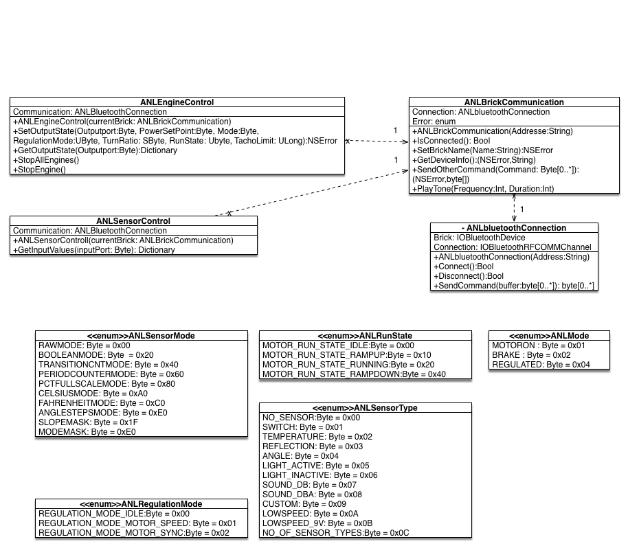

<h1>NXT-SWIFT</h1>
<h2>About</h2>

NXT-SWIFT has the goal to create an API in SWIFT for LEGO Mindstorm NXT. It will be possible to regulate the engine and read out all important sensor values.  At first there will be only a focus on the bluetooth connection. The serial connection will be developed at a later state of the prpject. 

<h2>Diagrams</h2>
<h3>class diagram</h3>

The class diagram is structured like this: 

